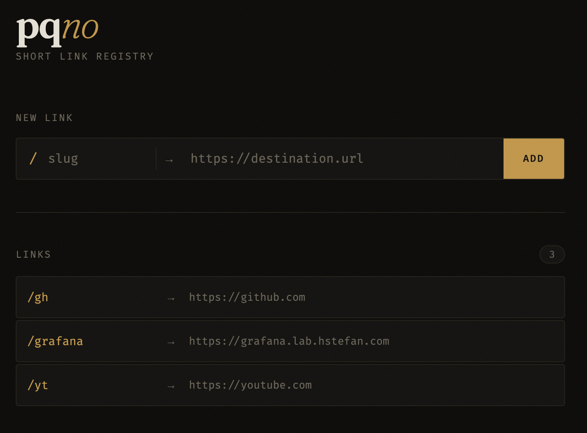

# pqno

**Minimal self-hosted URL shortener written in Rust.**

Map short slugs to URLs and serve instant redirects — no accounts, no tracking, no nonsense. Ships as a single binary with an embedded SQLite database and a clean dark web UI.



## Features

- **Fast** — built on [Rocket](https://rocket.rs), serves redirects in microseconds
- **Persistent** — SQLite backend, survives restarts, no external database required
- **Clean UI** — dark web interface to create, browse, and remove links
- **Validated** — rejects malformed or non-HTTP(S) URLs at both the API and UI layer
- **Kubernetes-ready** — Helm-free k8s manifests included, Traefik ingress, PVC for storage
- **Multi-arch** — Docker image built for `linux/amd64` and `linux/arm64`

## Quick start

```bash
cargo run
```

Open `http://localhost:8000`. Links are stored in `pqno.db`.

## API

```
POST /           {"slug": "gh", "url": "https://github.com"}  →  201 Created
GET  /<slug>     →  302 redirect
DELETE /<slug>   →  204 No Content
GET  /links      →  {"slug": "url", ...}
```

## Docker

```bash
docker run -p 8000:8000 -v $(pwd)/data:/data \
  -e DB_PATH=/data/pqno.db \
  hstefanp/pqno:latest
```

## Kubernetes (k3s)

```bash
make build    # build & push multi-arch image to Docker Hub
make deploy   # apply manifests (namespace, PVC, Deployment, Service, Ingress)
make restart  # rolling restart after a new image push
```

Manifests live in `k8s/`. The app runs in the `pqno` namespace behind a Traefik ingress. SQLite is mounted from a `local-path` PVC — keep `replicas: 1`.

## Configuration

| Variable | Default | Description |
|----------|---------|-------------|
| `DB_PATH` | `pqno.db` | Path to the SQLite database file |
| `ROCKET_ADDRESS` | `127.0.0.1` | Bind address (`0.0.0.0` in containers) |
| `ROCKET_PORT` | `8000` | Listen port |

## License

[MIT](LICENSE)
